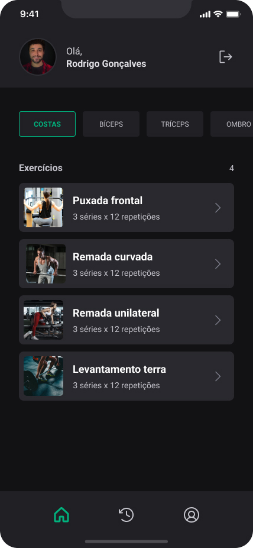
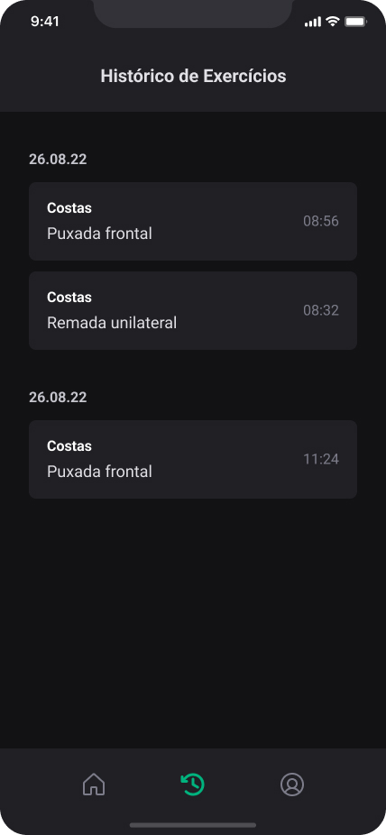
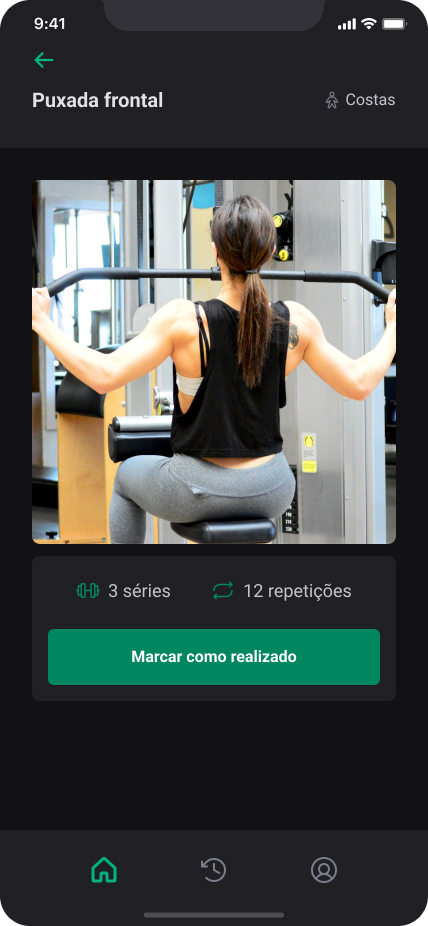

# Ignite Gym

Ignite Gym is a mobile app built using React Native and TypeScript. It allows users to see a list of exercises and mark them as done, as well as view a history of their completed exercises by date, and manage profile data like name, photo and etc. The app also includes user authentication, push notifications, and deep linking.

## Table of Contents

- [Features](#features)
- [Prototype](#prototype)
- [Screenshots](#screenshots)
- [Installation](#installation)
- [Development](#development)
- [Disclaimer](#disclaimer)

## Features

- User authentication.
- List of exercises.
- Ability to mark exercises as done.
- History of exercises done by date.
- Push notifications.
- Deep linking.

## Prototype

Check out the [Figma prototype](https://www.figma.com/file/i6JyLqGePnTHU2t7SbX0R8/Ignite-Gym-(Community)?node-id=37-6&t=ab6nEwjlczU2NPYw-0) for this project.

## Screenshots

Here are some screenshots of the project:

    
Click to view images

    <h2>Home</h2>
    
    <h2 style="margin-top: 50px">History</h2>
    
    <h2 style="margin-top: 50px">Exercise</h2>
    

## Installation

To run the Ignite Gym app on your machine, you will need to have the following tools installed:

### Prerequisites
- Node.js
- React Native CLI
- Android Studio (for Android development)
- Xcode (for iOS development)

### Installation

git clone this repository

### Database installation

1. `cd api` 
2. `npm run migrate` to create database table
3. `npm run seed` to populate tables
4. `npm run dev` to Run API in **development** environment 

### Install APP
1. `cd mobile`
2. `npm i` to install dependencies
3. On `config_example.js` rename it to config.js and insert api url and One Signal Key.
4. `npx expo prebuild` to generate buid, this a bare workflow project so this step is needed 
5. `npx expo run:android` or `npx expo run:ios` to run app on emulator or on conected device. You can also run `npx expo start` to run the app using expo dev client.

#### Usage 

After the installation is done, to run the app you just need to `npm run dev` on API paste and `npx expo start` on mobile paste.

## Development

Ignite Gym was initially developed using Expo managed workflow, but later switched to bare workflow during development. The app was built using React Native and TypeScript, and uses various technologies and libraries such as Axios, React Hook Form, Yupe and etc. All libraries are displayed on mobile `package.json` file.

## Disclaimer

This project's design and API was provided by [@Rocketseat](https://github.com/Rocketseat) as part of the Ignite course. In this project the mobile front end was deleped in webclass and push notifications and deep linking was implemented by me.